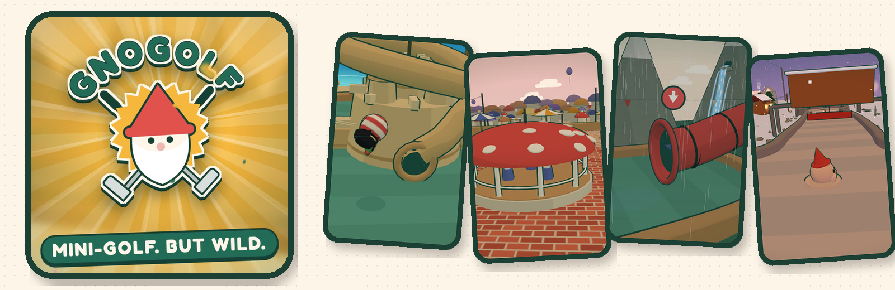

# Gnogolf

A 3D mini-golf game on [gno.land](https://gno.land). The holes live on-chain,
and so does the physics: the chain plays every shot.

## How it works

You pull back like a slingshot and let go. The client sends that decision (an
angle, a power, the moment you let go) and the `golf` realm rolls the ball
itself. Nobody ever sends "I scored 2": a recorded round is the chain's own
replay of your shots, and anyone can replay it again.

- Playing is free. A shot's preview is a read-only query, so you need no wallet
  to play the whole course.
- Keeping a score takes one transaction per hole (two for a long round),
  signed with [Adena](https://www.adena.app/). It then goes on the leaderboard.
- You can read a hole's code on gnoweb before you play it.

There are four cups of 18 holes (Garden, Island, Mushroom Town, Mountain) and
two extras. Some holes move, so timing is part of the shot. Every hole has
weather (wind, rain, fog, storm, snow), which changes every five minutes of
chain time and is the same for everyone.

## Running it locally

You need a `gnolang/gno` checkout next to this repo, Go, and Node.

**1. The chain.** The installed `gnodev` is older than the checkout (it fails
with `pubKeyAddress does not have a body`), so build it from source:

```sh
(cd ../gno/contribs/gnodev && go build -o /usr/local/bin/gnodev .)
gnodev local -node-rpc-listener 127.0.0.1:26757   # from this repo's root
```

gnoweb is then on `http://127.0.0.1:8888` and the RPC on
`http://127.0.0.1:26757`, the web client's default.

**2. The holes.** The course is data (`data/holes.txt`), and only golf's owner
can publish it. Under gnodev that's the deploy key, `test1`:

```sh
scripts/publishdata.sh 7   # writes scripts/publish/publish-NN.gno, 7 holes each
gnokey maketx run -gas-fee 1000000ugnot -gas-wanted 1000000000 \
  -remote http://127.0.0.1:26757 -chainid dev -broadcast test1 scripts/publish/publish-01.gno
```

Run them in order. A slot already up to date is skipped, so a failed script
can just be run again.

**3. The web client.**

```sh
cd web
npm install
npm run dev     # development server
npm run build   # static export to web/out/, host it anywhere
npm run typecheck && npm run lint && npm run selfcheck   # selfcheck fails if the client's copy of the realm's rules drifts
```

The client takes its config from the URL, so one build works with any chain:
`?rpc=`, `?web=`, `?hole=garden/7` or `?cup=garden&hole=7`.

For the Gno tests, point `GNOHOME` at a package cache holding the gno
checkout's `examples/` copies of `avl`, `ufmt`, `uassert` and `urequire`: the
module cache's `p/nt/avl` differs from the chain's.

## Writing a hole

A hole is geometry: a `course.Simple`, encoded as data and published with
`golf.PublishMine(slug, hexData, note)`. It becomes a community hole: playable,
and recorded on its own board, but in no cup and not in the rankings. No hole runs code of its own:
golf decodes the data and plays it with its own physics.

```go
var me = &course.Simple{
	World: "garden", Order: 21,
	W: 40, H: 12, // the board: 1 to 96 a side
	Title:     "First Hole",
	Strokes:   3, // par
	Tee:       physics.V(4, 6),
	Pin:       physics.V(35, 6),
	Substeps:  24,
	CupRadius: 1.2,

	Course: &physics.Field{
		Walls: physics.Walls(
			physics.Box(physics.V(0, 0), physics.V(40, 12)),
			physics.Bar(physics.V(20, 0), physics.V(20, 7), 0.8, '=', "hedge"),
		),
		Posts: []physics.Post{
			{Circle: physics.Circle{C: physics.V(28, 4), R: 1.0}, Bounce: 1.2, Skin: "bumper"},
		},
		Zones: []physics.Zone{
			{Kind: physics.Surface, Min: physics.V(10, 8), Max: physics.V(16, 12), Scale: 0.55, Skin: "sand"},
		},
		Friction: 0.86,
		Bounce:   0.85,
		Radius:   0.5,
	},
}

var hexData = hex.EncodeToString([]byte(course.Encode(me)))
```

Its id is `<your address>/<slug>/v1`, and only you can add versions to it. A
`Skin` is only a hint: a client that doesn't know `"hedge"` draws a plain wall.
The course's own holes, in `gno.land/r/gnogolf/`, are the best examples.

## Who can change what

The golf realm has one role, its owner (the account that deployed it). The
owner publishes the course's holes and their new versions. A new version
archives the old one: still playable, its records kept, but out of the
course-wide ranking. The owner can also set the game's link, name a successor
realm once, and hand the role on or give it up for good.

The owner can't edit or delete a hole, a round or a score, can't touch
anyone's community hole, the weather or the physics, and can't pause or
upgrade the realm. The details are in
[docs/golf.md](docs/golf.md#who-can-change-what).

## Repo layout

```
gno.land/p/gnogolf/physics   2D rolling-ball engine
gno.land/p/gnogolf/course    the hole contract and the weather
gno.land/r/gnogolf/golf      the game realm: holes, rounds, previews, boards, gnoweb page
gno.land/r/gnogolf/<hole>    each course hole's source
web/                         Next.js + three.js client (static export)
data/holes.txt               the course as data, one line per slot
```

## Docs

- [docs/physics.md](docs/physics.md): the physics, usable by other Gno games.
- [docs/course.md](docs/course.md): the hole contract, timed pieces, weather.
- [docs/golf.md](docs/golf.md): the realm's API, and how it's updated after the deploy.
- [docs/leaderboards.md](docs/leaderboards.md): the boards, and the bot check.
- [CLIENT.md](CLIENT.md): how to write a client.
- [adr/](adr/): the architecture decisions.
