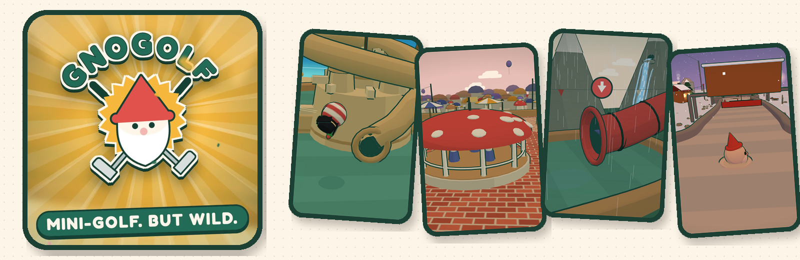

# Gnogolf

A 3D mini-golf game on [gno.land](https://gno.land). The holes live on-chain,
and so does the physics: the chain plays every shot.

**Race anyone's ghost, verified on-chain.** Every best round on the boards is
a ghost you can take turns against, stroke for stroke: a rival picked for
the day, a player at your level, a friend, or yourself. The chain kept it, so nobody
can fake one, and there is no game server: the chain is the referee. Next:
**build a hole, own it forever**, the contract side is ready and closed
behind a switch, the in-game editor comes with the second wave.
[The pitch, in one page](docs/pitch.md).

## How it works

You pull back like a slingshot and let go. The client sends that decision (an
angle, a power, the moment you let go) and the `golf` realm rolls the ball
itself. Nobody ever sends "I scored 2": a recorded round is the chain's own
replay of your shots, and anyone can replay it again.

- Playing is free. A shot's preview is a read-only query, so you need no wallet
  to play the whole course.
- Keeping a score takes one transaction per hole (more for a long round),
  signed with [Adena](https://www.adena.app/), or with gnokey: the game gives
  the command to paste in a terminal, and confirms the save on the chain by
  the key's address (typed once, kept in the browser). The name, a Claim and a tip can go the same way. A
  finished round isn't kept on chain, only your best, so a save costs a
  storage deposit only the first time you finish a hole: about 0.29 GNOT for
  your first hole on the course, about 0.10 for each hole after, nothing for
  a replay, plus about 0.05 GNOT of fees a transaction.
- The boards list players with a gno.land name, so a script can't flood them
  with throwaway addresses. You can take a name without leaving the game, in
  the same signature that ranks the rounds you saved before it. Rounds saved
  without a name are still kept, and shown apart under each board.
- A bot check reads the boards twice a day and takes off them the rounds
  that look machine-made, never a player for playing well; a hidden player
  is told why, and can say it's a mistake
  ([docs/leaderboards.md](docs/leaderboards.md), "Bot check").
- A hole's board ranks by strokes. The course ranking counts the holes you
  finished, then your score against par over them (your best on each, less
  its par, added up), then who got there first: a hole at par counts the same
  whatever its par. Each record shows the weather it was played in.
- You can read a hole's code on gnoweb before you play it.
- A saved round dares your friends: your share link has them race your best
  as a see-through ghost, stroke for stroke. The ghost is your real round,
  replayed by the chain in the weather you had, so it can't be faked, and
  racing it costs only free reads ([ADR-004](adr/adr-004-duels.md)).
- Or pick a rival yourself: after the title, choose Duel, then whose ghost
  (a friend's name or address, or anyone on the board), then one of their
  ghosts, listed hole by hole with their best to beat. The ghost wears
  another gnome than yours, and each turn is called out: yours, then theirs.
  On a board or in Friends, "Race here" starts at once on the hole you're on
  (their ghost there), and "Their holes" lists their ghosts to pick one.
- Badges (an ace, all six weathers, a duel won…) are kept in your browser
  and stamped on the cup card, on the hole each was earned on. New game
  clears them with your scores; the gnomes you unlocked stay.
- Support, the chip by the network banner (on a phone, in About), sends an optional 1, 5 or 10
  GNOT tip: a plain bank send to the golf realm's `Owner()` as read on the
  chain, confirmed in Adena or gnokey. Playing stays free. On mainnet, while
  GNOT can't be sent, there is no Support chip.
- Visits are measured anonymously (PostHog EU, no banner); the About sheet
  says so and turns it off in one click
  ([docs/analytics.md](docs/analytics.md)). The font is served by the site
  itself.

There are four cups of 18 holes (Garden, Island, Mushroom Town, Mountain),
then the Crystal Mines, the expert cup: 18 long holes of three to
five minutes each (par 158), their pars set by what a good player can do in the
worst weather ([ADR-005](adr/adr-005-crystal-mines.md), "As built"). It is
open from the start like the four, and its holes count in the course ranking
like any other, once published. A cup always starts from its first hole, with a fresh round. The
menu's Mode goes back to Solo or Duel, All cups to the cups (a duel's ghosts
in a duel), and Gnome to the gnome picker. Some holes move, so timing is part of the shot. Every hole has
weather (wind, rain, fog, storm, snow; the Crystal Mines have theirs underground,
still air, a draught, dripping and lights out, never a storm or snow), which
changes every five minutes of chain time and is the same for everyone.

## Running it locally

You need a `gnolang/gno` checkout next to this repo, Go, and Node.

**1. The chain.** The game deploys on onyx (`onyx-1`, mainnet's code), so the
tools are built from the tag `chain/onyx` (a worktree of the checkout, which
stays on its own branch), into the folder the scripts look in
(`GNO_TOOLCHAIN`, `~/.cache/gno-toolchains/onyx` unless set). Each finds its
`GNOROOT`, that worktree, by itself:

```sh
t=${GNO_TOOLCHAIN:-~/.cache/gno-toolchains/onyx}
git -C ../gno worktree add ../gno-onyx chain/onyx
(cd ../gno-onyx/gnovm && go build -o $t/gno ./cmd/gno)
(cd ../gno-onyx/gno.land && go build -o $t/gnokey ./cmd/gnokey)
(cd ../gno-onyx/contribs/gnodev && go build -o $t/gnodev .)
export PATH=$t:$PATH
gnodev local -empty-blocks -empty-blocks-interval 5   # from this repo's root
```

That gives you gnoweb on `http://127.0.0.1:8888` and the RPC on
`http://127.0.0.1:26657`, the web client's default. Three things we learned
the hard way:

- **Keep `-empty-blocks`.** Without it gnodev only makes a block when a
  transaction arrives, so its clock stops. The weather changes every five
  minutes of chain time, and a frozen clock makes every new round look like
  its weather is already over.
- **Keep port 26657.** Adena's built-in `dev` network points there, with
  chain id `dev`. Run the node anywhere else and Adena can't sign for it (it
  won't add a second `dev` network).
- **Open `http://127.0.0.1:8888/r/sys/namereg/v0` once.** gnodev loads
  packages lazily, and registering a name straight after a restart fails
  until the registrar has been loaded. Onyx and mainnet deploy it at genesis,
  so this is local only.

**2. The holes.** The course is data (`data/holes.txt`), and only golf's owner
can publish it. Under gnodev that's the deploy key, `test1`, which your
gnokey needs once (`gnokey add test1 --recover`, with the mnemonic gnodev
prints at start):

```sh
scripts/publishdata.sh test1   # one gnokey call of Publish a hole, then a check of every slot
```

It asks the key's password once. A slot already up to date is skipped, so a
failed run can just be run again; `scripts/publishdata.sh -verify` is the
check alone. To save a round from the game, fund your Adena account from
`test1` with `gnokey maketx send`.

**3. The web client.**

```sh
cd web
npm install
npm run dev     # development server
npm run build   # static export to web/out/, host it anywhere
npm run typecheck && npm run lint && npm run selfcheck   # selfcheck fails if the client's copy of the realm's rules drifts
```

The client takes its config from the URL: `?hole=garden/7` or
`?cup=garden&hole=7`, `?screen=cups` for the cups screen, and in a dev or local build `?rpc=` and `?web=` (a
production build served from a public host ignores them and plays
`NEXT_PUBLIC_RPC` and `NEXT_PUBLIC_WEB`).
`NEXT_PUBLIC_CLIPS=1` at build time offers a clip of the holing shot in the
hole-finished card ([ADR-003](adr/adr-003-sharing.md); `?clips` in a dev build).
`NEXT_PUBLIC_POSTHOG_KEY` turns on anonymous audience measurement (PostHog EU,
[docs/analytics.md](docs/analytics.md)); unset, as in local dev, nothing loads.

`scripts/check.sh` runs the Gno tests with that `gno` (or the one `GNO`
names), which fetches the packages the tests import from gno.land (mainnet,
the code onyx runs) into `$GNO_TOOLCHAIN/gnohome`, a cache of its own. With
no `gno` there it fails; `SKIP_GNO=1 scripts/check.sh` checks the client
alone, and says so.

The assisted aim's preview runs the realm's physics in the page
(`web/lib/sim/golf.wasm`, committed, so a deploy needs no Go). After changing
the physics, the course or the golf realm's simulation, rebuild it with
`npm run wasm` (TinyGo 0.42.0: `brew install tinygo-org/tools/tinygo`) and
commit it; `check.sh` fails until you do.

## Writing a hole

A hole is geometry: a `course.Simple`, encoded as data and published with
`golf.PublishMine(slug, hexData, note)`, once the owner opens publishing
(`SetPublishing`; closed at launch, until the Builder). It becomes a community hole: playable,
and recorded on its own board, but in no cup and not in the rankings. No hole runs code of its own:
golf decodes the data and plays it with its own physics.

```go
var me = &course.Simple{
	World: "garden", Order: 21,
	W: 40, H: 12, // the board: 1 to 96 a side
	Title:     "First Hole",
	Strokes:   3, // par
	Tee:       physics.V(4, 6),
	Pin:       physics.V(35, 6),
	Substeps:  24,
	CupRadius: 1.2,

	Course: &physics.Field{
		Walls: build.Walls(
			build.Box(physics.V(0, 0), physics.V(40, 12)),
			build.Bar(physics.V(20, 0), physics.V(20, 7), 0.8, '=', "hedge"),
		),
		Posts: []physics.Post{
			{Circle: physics.Circle{C: physics.V(28, 4), R: 1.0}, Bounce: 1.2, Skin: "bumper"},
		},
		Zones: []physics.Zone{
			{Kind: physics.Surface, Min: physics.V(10, 8), Max: physics.V(16, 12), Scale: 0.55, Skin: "sand"},
		},
		Friction: 0.86,
		Bounce:   0.85,
		Radius:   0.5,
	},
}

var hexData = hex.EncodeToString([]byte(course.Encode(me)))
```

Its id is `<your address>/<slug>/v1`, and only you can add versions to it. A
`Skin` is only a hint: a client that doesn't know `"hedge"` draws a plain wall.
`build` is `gno.land/p/gnogolf/physics/build`, the wall builders; the course's
holes also finish with `author.Fit` (`gno.land/p/gnogolf/course/author`). Both
are for writing holes only: nothing on chain needs them.
The course's own holes, in `gno.land/r/gnogolf/`, are the best examples.

## Who can change what

The golf realm has one role, its owner (the account that deployed it). The
owner publishes the course's holes and their new versions. A new version
archives the old one: still playable, its records kept, but out of the
course-wide ranking. The owner can also open or close community publishing
(closed at launch), hide a community hole from the lists (for abuse; it stays
playable), set the game's link, name a successor realm once, and hand the role
on or give it up for good.

The owner can't edit or delete a hole, a round or a score, can't touch
anyone's community hole, the weather or the physics. The records live in a
realm of their own, `store`, apart from the rules: its owner can propose new
rules, which take over three days after their code is on chain (anyone can
read it first), and can stop every save at once for a bug (the reads go on)
and start the same rules again, never write a record.
The details are in [docs/golf.md](docs/golf.md#who-can-change-what).

## Repo layout

```
gno.land/p/gnogolf/physics   2D rolling-ball engine
gno.land/p/gnogolf/course    the hole contract and the weather
gno.land/r/gnogolf/store     the records: every hole, round, best, board and standing
gno.land/r/gnogolf/golf/v2   the rules: rounds, previews, boards, gnoweb page (the only writer of store)
gno.land/r/gnogolf/golf      v1, the rules before: on onyx, its records copied into v2
gno.land/r/gnogolf/<hole>    each course hole's source
web/                         Next.js + three.js client (static export)
data/holes.txt               the course as data, one line per slot
```

On a chain, the deployed packages sit under their owner's name and the game's
sub-path: `p/<ns>/gnogolf/physics`, `p/<ns>/gnogolf/course`,
`r/<ns>/gnogolf/store` and `r/<ns>/gnogolf/golf/v2` (and v1 on onyx).
`scripts/stage.sh <ns>` stages them so (`MAINNET=1`: without v1 and the import
of its records), and `scripts/importv1.sh` copies onyx's v1 records into v2.

## Docs

- [docs/pitch.md](docs/pitch.md): the game in one page, to share.
- [docs/physics.md](docs/physics.md): the physics, usable by other Gno games.
- [docs/course.md](docs/course.md): the hole contract, timed pieces, weather.
- [docs/golf.md](docs/golf.md): the realm's API, and how it's updated after the deploy.
- [docs/leaderboards.md](docs/leaderboards.md): the boards, the ghost duels, and the bot check.
- [CLIENT.md](CLIENT.md): how to write a client.
- [docs/analytics.md](docs/analytics.md): the anonymous audience measurement.
- [adr/](adr/): the architecture decisions.
