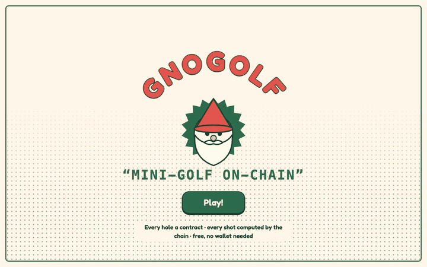

# Gnogolf

A 3D mini-golf game that runs on [gno.land](https://gno.land). Every hole is a
realm someone deployed, and the chain computes every shot.



## Why on-chain

The chain doesn't just store your score. It plays your shots. The client sends
decisions (an angle, a power, and when you let go) and the `golf` realm replays
them through the physics to see where the ball ends up. There's no "I scored 2"
message anywhere. A recorded round is the chain's own replay of what you did,
and anyone can replay it again from the shots it keeps, so you can't fake a
score.

It also means:

- Previewing a shot is a free read-only query (`vm/qeval`). You can play every
  hole without a wallet or an account. Nothing gets recorded until you ask for
  it.
- Recording a whole hole takes one transaction (`PlayRound`), not one per
  shot.
- The golf realm has no admin: no owner, no pause, no upgrade, no delisting.
  Anyone can publish a hole, and nobody can take one down.
- You can read a hole's source on gnoweb before you play it. The physics you
  trust is code you can read.

## How to play

Click (or touch) anywhere, pull back like a slingshot, and let go. The further
you pull, the harder you hit. The ball rolls, bounces off rails and bumpers,
slows down in sand, speeds up on ice, goes through tunnels, and flies off the
top of a fast slope. Get it in the cup in as few strokes as you can. Each hole
has a par.

Some holes move: a mill's sails turn, a tram crosses, a gate closes every other
stroke. Some depend on when you let go, so timing is part of the shot. Every cup hole
hole also has weather (clear, wind, rain, fog, storm or snow). It changes every
five minutes of chain time and is the same for everyone.

There are four cups of 18 holes each:

| Cup | World | Realms |
|---|---|---|
| Garden Cup | `garden` | `r/gnogolf/hole1` … `hole20` (without `hole10` and `hole16`, which are in `extras`) |
| Island Cup | `island` | `r/gnogolf/island1` … `island18` |
| Mushroom Town | `town` | `r/gnogolf/town1` … `town18` |
| Mountain Cup | `mountain` | `r/gnogolf/mountain1` … `mountain18` |

Practice is free. Connect [Adena](https://www.adena.app/) when you want to keep
a round: it gets signed as one transaction (`Reset` + `PlayRoundAt`) and goes on
the leaderboard once the ball is holed.

## Running it locally

You need a `gnolang/gno` checkout next to this repo, Go, and Node.

**1. The chain.** The `gno` and `gnodev` binaries you get from installing are
older than the checkout and fail with `pubKeyAddress does not have a body`,
so build `gnodev` from source:

```sh
cd ~/Server/gnoland/gno/contribs/gnodev && go build -o /usr/local/bin/gnodev .
cd ~/Server/gnoland/gnogolf && gnodev local -node-rpc-listener 127.0.0.1:26757
```

gnodev loads every package under `gno.land/` from disk. gnoweb runs on
`http://127.0.0.1:8888`, and the RPC runs on `http://127.0.0.1:26757`, which is
the web client's default.

**2. Register the holes.** A deployed hole doesn't count until it registers
itself with `golf`. It can't do that from `init()`, so it takes one transaction
per hole: call the hole realm's `Register` function. For example, with a funded
key on the dev chain:

```sh
gnokey maketx call -pkgpath gno.land/r/gnogolf/hole1 -func Register \
  -gas-fee 40000ugnot -gas-wanted 20000000 \
  -remote http://127.0.0.1:26757 -chainid dev -broadcast <your-key>
```

Run it again for every hole realm (`hole*`, `island*`, `town*`,
`mountain*`). A registration used about 13M gas in our runs. You can also do
all of them in one `MsgRun` that calls each hole's `Register`. BACKLOG.md
mentions that script, but it isn't in this tree.
Once they're registered, `http://127.0.0.1:8888/r/gnogolf/golf` lists them.

**3. The web client.**

```sh
cd web
npm install
npm run dev          # development server
npm run build        # static export to web/out/, host it anywhere
```

The client reads its config from the query string, so one build works with any
chain: `?rpc=` for the node, `?web=` for gnoweb, `?hole=` for a hole's pkgpath,
and `?shot=angle,power` to fire a shot on load.

To run the Gno tests, see "Toolchain gotchas" in [BACKLOG.md](BACKLOG.md): the
test harness needs a package cache that matches the chain.

## Repo layout

```
gno.land/p/gnogolf/physics   2D rolling-ball engine: walls, posts, zones, Step
gno.land/p/gnogolf/course    the hole contract: Hole interface, course.Simple, weather
gno.land/r/gnogolf/golf      the game realm: registry, rounds, previews, leaderboard, gnoweb page
gno.land/r/gnogolf/<hole>    one realm per hole (hole1…, island1…, town1…, mountain1…)
web/                         Next.js + three.js client (static export)
adr/                         architecture decision records
media/                       screenshots and the demo video
CLIENT.md                    the contract for writing a client
BACKLOG.md                   measurements, decisions, what's next
```

## Writing a hole

Most holes are just geometry, and `course.Simple` covers that. A hole is a
realm with a `course.Simple` value and a `Register` function:

```go
package myhole

import (
	"gno.land/p/gnogolf/course"
	"gno.land/p/gnogolf/physics"
	"gno.land/r/gnogolf/golf"
)

var me = &course.Simple{
	World: "garden", Order: 21,
	W: 40, H: 12, // the board; 0 means 32x16
	Title:     "First Hole",
	Strokes:   3, // par
	Tee:       physics.V(4, 6),
	Pin:       physics.V(35, 6),
	Substeps:  24,
	CupRadius: 1.2,

	Course: &physics.Field{
		Walls: physics.Walls(
			physics.Box(physics.V(0, 0), physics.V(40, 12)),
			physics.Bar(physics.V(20, 0), physics.V(20, 7), 0.8, '=', "hedge"),
		),
		Posts: []physics.Post{
			{Circle: physics.Circle{C: physics.V(28, 4), R: 1.0}, Bounce: 1.2, Skin: "bumper"},
		},
		Zones: []physics.Zone{
			{Kind: physics.Surface, Min: physics.V(10, 8), Max: physics.V(16, 12), Scale: 0.55, Skin: "sand"},
		},
		Friction: 0.86,
		Bounce:   0.85,
		Radius:   0.5,
	},
}

// Register publishes this hole to golf. It can't run from init(): there is no
// `cur` there, so it takes one transaction after the deploy.
func Register(cur realm) { golf.Register(cross(cur), me) }
```

Deploy it with your own key (sessions can't use `vm/add_package`), then call
`Register` once. The hole's id is its pkgpath, so nobody else can claim it. A
`Skin` is only a hint for renderers: a client that doesn't know `"hedge"` draws
a plain wall.

The hole realms in `gno.land/r/gnogolf/` are the best examples. `hole2` has a
mole that pops up (`Pulses`), `hole4` has timed sails, `hole20` has a loop, and
`island6` has a no-rail lane over the sea (an `Outside` polygon hazard). Every cup hole
comes with a `z_any_test.gno` that solves the hole in calm weather and in
the worst weather it can get.

## Docs

- [docs/physics.md](docs/physics.md): the physics package, usable as a 2D
  mini-golf engine by other Gno games.
- [docs/course.md](docs/course.md): the hole contract, `course.Simple`, timed
  pieces, the weather.
- [docs/golf.md](docs/golf.md): the golf realm's public API and its JSON.
- [CLIENT.md](CLIENT.md): how to write a client (the reads, the double
  unwrap, animating a path, the four rules).
- [BACKLOG.md](BACKLOG.md): gas and latency measurements, and the design
  decisions behind them.
- [adr/adr-001-architecture.md](adr/adr-001-architecture.md): the original
  architecture.
